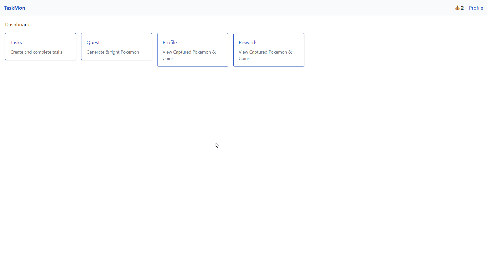
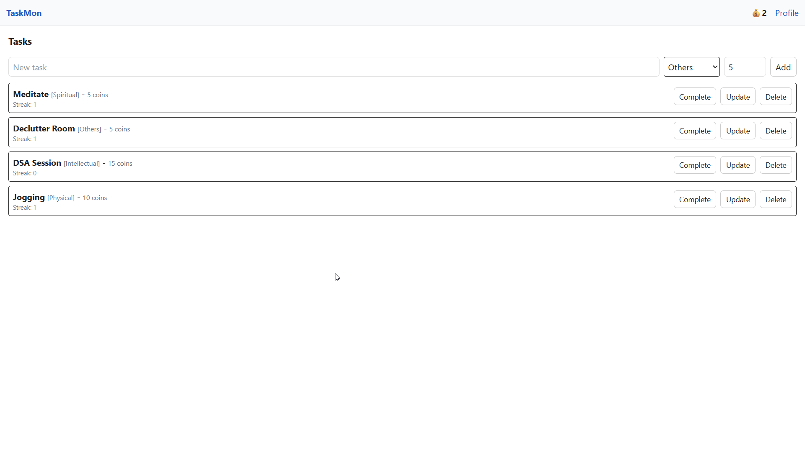
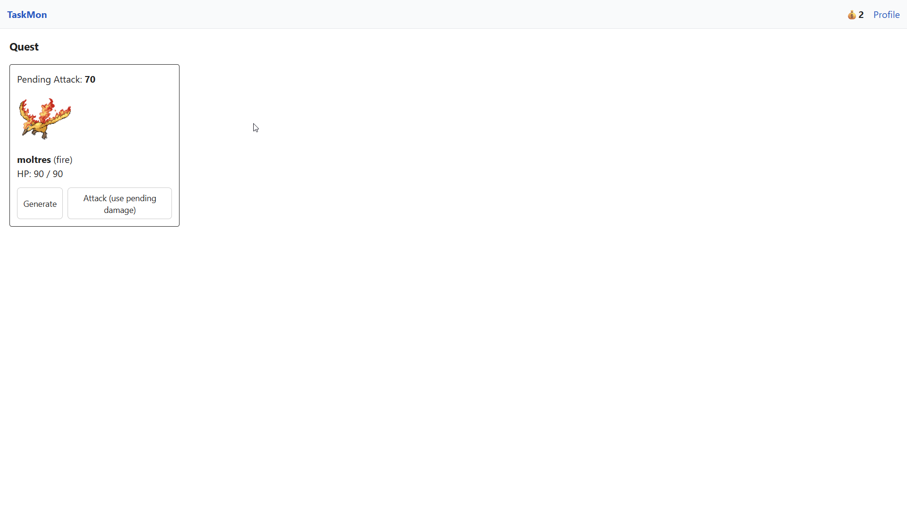
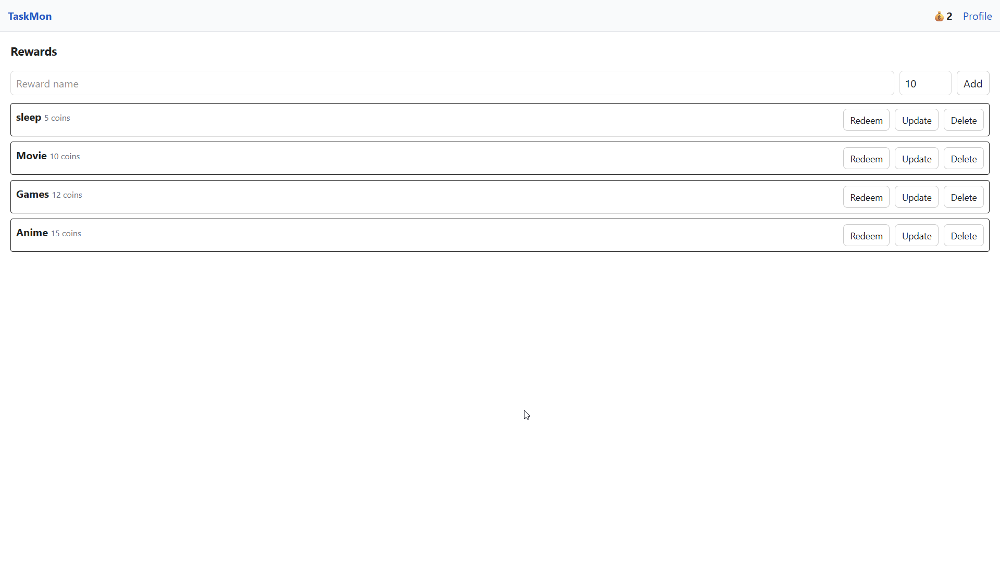
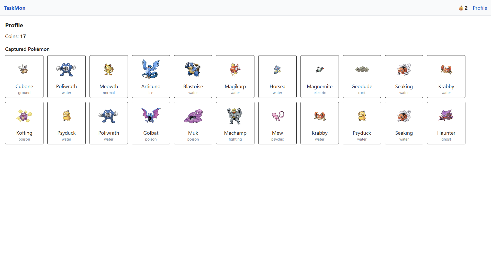

# Gamified Task Manager 🏆

A fun and interactive task manager that gamifies your daily tasks! Complete tasks to earn coins, unlock rewards, and even battle quests with Pokémon-style mechanics. Built with **React**, **Node.js**, **Express**, and **MongoDB**.


---

## Features

- **Task Management**: Create, update, complete, and delete tasks. Assign categories and coin rewards.
- **Coin System**: Earn coins by completing tasks.
- **Rewards**: Redeem coins for rewards you create. Add custom rewards with cost and category.
- **Quest System**: Fight quests and catch Pokémon by completing tasks.
- **User Tracking**: Unique user identification with localStorage (`userId`).

---

## Tech Stack

- **Frontend**: React, Tailwind CSS
- **Backend**: Node.js, Express.js
- **Database**: MongoDB with Mongoose
- **API**: RESTful endpoints for tasks, rewards, and quests

---

## Installation

1. **Clone the repository**

```bash
git clone https://github.com/your-username/gamified-task-manager.git
cd gamified-task-manager
```

2. **Install dependencies**

```bash
# Server
cd server
npm install

# Client
cd ../client
npm install
```

3. **Configure environment variables**

Create a `.env` file in `server`:

```env
MONGO_URI=your_mongodb_connection_string
PORT=4000
```

4. **Run the project**

```bash
# Start backend
cd server
npm run dev

# Start frontend
cd ../client
npm start
```

Open [http://localhost:3000](http://localhost:3000) in your browser.

---

## API Endpoints

### Tasks

- `GET /api/tasks` – List all tasks
- `POST /api/tasks` – Create a task
- `PATCH /api/tasks/:id` – Update a task
- `DELETE /api/tasks/:id` – Delete a task
- `POST /api/tasks/:id/complete` – Mark task as complete

### Rewards

- `GET /api/rewards` – List rewards
- `POST /api/rewards` – Create a reward
- `PATCH /api/rewards/:id` – Update a reward
- `DELETE /api/rewards/:id` – Delete a reward
- `POST /api/rewards/:id/redeem` – Redeem a reward

### Quest (Pokémon system)

- `POST /api/quest/generate` – Generate a random quest
- `GET /api/quest` – Get current quest
- `POST /api/quest/attack` – Attack quest
- `GET /api/quest/pokemons` – Get user’s Pokémon

---

## Project Structure

```
gamified-task-manager/
├─ client/             # React frontend
│  ├─ src/
│  ├─ public/
├─ server/             # Express backend
│  ├─ controllers/
│  ├─ models/
│  ├─ routes/
│  ├─ config/
│  ├─ index.js
├─ .env
├─ package.json
├─ README.md
```

---

## Demo

### Dashboard



### Tasks



### Quest



### Rewards



### Profile



---

## Contributing

Contributions are welcome! Please follow these steps:

1. Fork the repository
2. Create your feature branch (`git checkout -b feature/my-feature`)
3. Commit your changes (`git commit -m 'Add new feature'`)
4. Push to the branch (`git push origin feature/my-feature`)
5. Open a Pull Request

---

## License

This project is open-source and available under the **MIT License**.

---

## Contact

Developed by **Auro Bhuyan**

- GitHub: [github.com/AuroBhuyan](https://github.com/AuroBhuyan)
- Email: [aurobhuyanprofession@example.com](mailto:your-aurobhuyanprofession@example.com)
